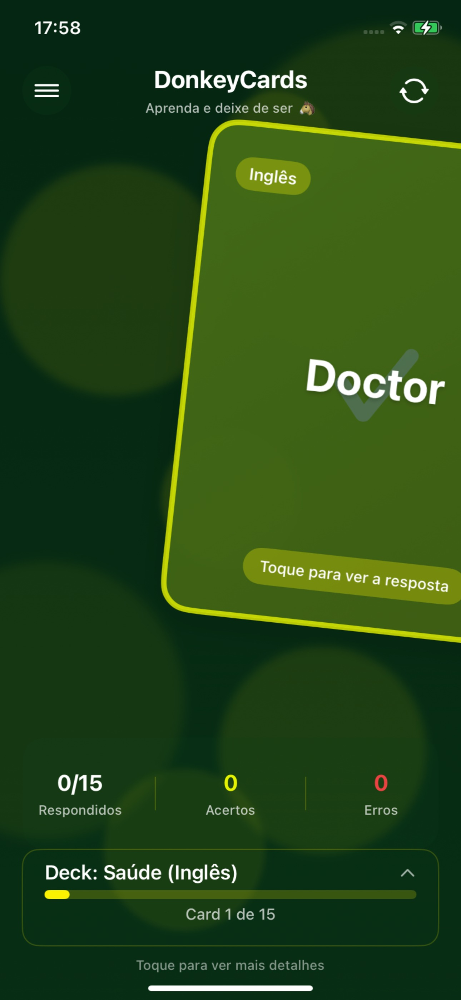
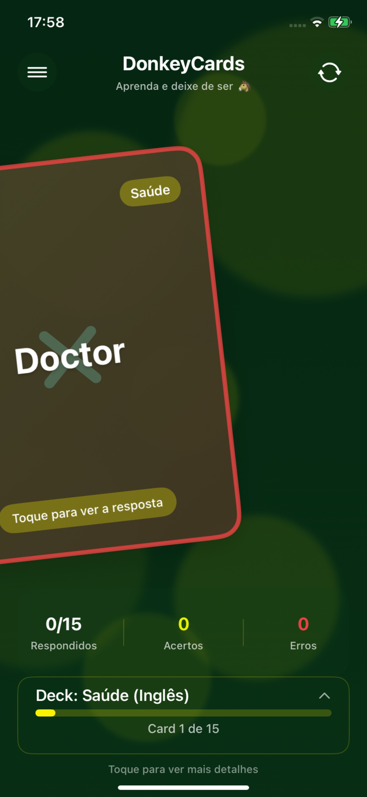
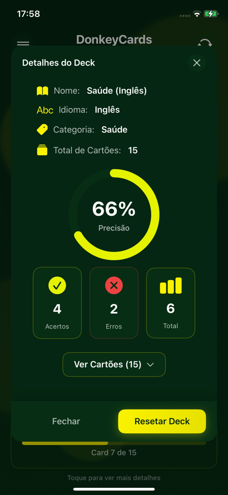
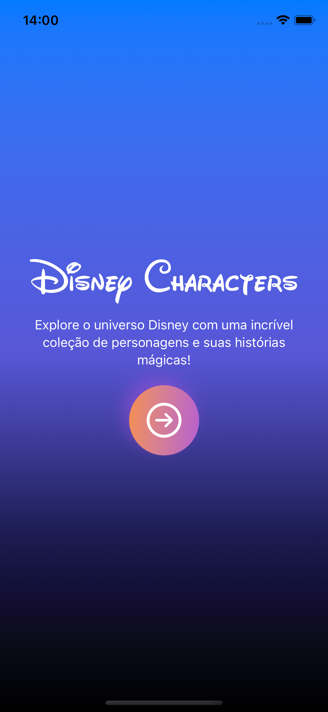
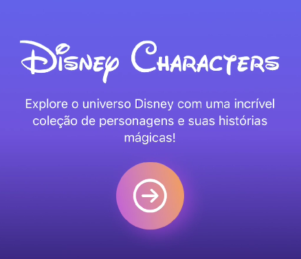
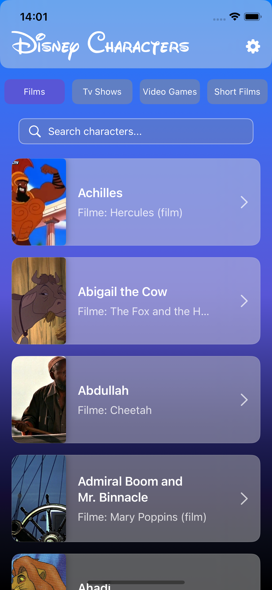

<h1 align="center">Lucas Picinin</h1>

  Desenvolvedor iOS focado em <strong>SwiftUI</strong>, apaixonado por criar experiências digitais intuitivas e modernas.

  
  
  

---

## 🚀 Sobre

🎓 Graduando em Engenharia de Software na PUC Minas  
📍 Baseado em Lima, Peru  
📱 Especializado em desenvolvimento mobile nativo com foco em UX  
🧠 Explorando soluções criativas com código limpo, Swift moderno e animações nativas

---

## 🧩 Projetos

### 🐵 DonkeyCards
> App para estudar idiomas com flashcards inteligentes

🔗 [App Store](https://apps.apple.com/pe/app/donkeycards/id6744418608?l=en-GB)  
📂 [Repositório](https://github.com/Lucas-Lutti/DonkeyCards-iOS)  
🛠 **Tecnologias:** SwiftUI · Firebase Firestore · Combine · Swift Package Manager  

  
  
  

---

### 🎬 Explorador de Personagens da Disney
> Navegue e explore personagens da Disney com consumo de API e layout responsivo

📂 [Repositório](https://github.com/Lucas-Lutti/DisneyCharactersProject)  
🛠 **Tecnologias:** Swift · SwiftUI · REST · API da Disney  

  
  
  

---

### 🌍 HubYourTrip
> MVP para descoberta e reserva de passeios turísticos

🔒 Repositório privado  
🛠 **Tecnologias:** SwiftUI · CoreLocation · AppStorage · MVVM  
📷 *(Adicione uma imagem aqui quando disponível)*

---

## 🧠 Linguagens mais utilizadas

  

---

## 📫 Contato

- 📧 Email: [lucaspicinin@hotmail.com](mailto:lucaspicinin@hotmail.com)  
- 💼 LinkedIn: [linkedin.com/in/lucas-picinin-campos-lutti](https://www.linkedin.com/in/lucas-picinin-campos-lutti-504219227/)  
- 📱 WhatsApp: [Clique aqui para conversar](https://wa.me/5531995193110)

---
